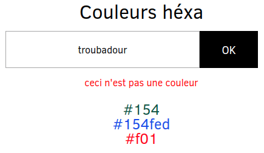

# Clic !

## Exo 1 : compteur

Créer un compteur de clics.

## Exo 2 : sondage

On peut cliquer sur deux boutons, et il faut compter le nombre de clics sur chacun d'eux :

## Exo 3 : liste de courses

1. Récupérer le contenu d'un input à la soumission du formulaire
2. Si pas de contenu, message d'erreur dans la console
3. Si une `value` existe, on ajoute un nouvel élément dans la liste ordonnée `<ol>`

## BONUS Exo 4 : couleurs

1. Tester si la `value` est une couleur
	=> Il faut que ça commence par un #
	=> Il faut que la longueur fasse 4 (#FFF) ou 7 (#FFFFFF)
2. Si ce n'est pas une couleur, écrire un message d'erreur.
3. Si c'est une couleur, on l'ajoute au `<ul>`.
4. On met le `<li>` dans la couleur de la couleur tapée
5. On supprime la valeur de l'input à la soumission du formulaire

